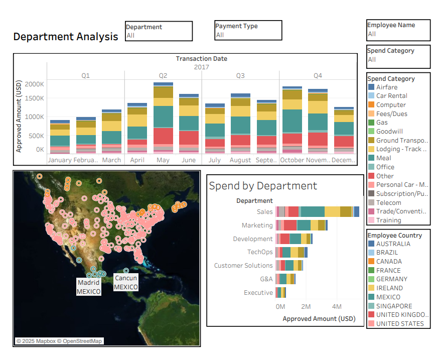

# IT Internal Audit Dashboard – Tableau (Spring 2025)

**Workbook:** `Assignment 2 IT Internal Audit IS444 Spring 2025.twbx`  
*(Open in Tableau Desktop or Tableau Public.)*

---

## 📊 Project Overview
Designed an interactive Tableau dashboard that empowers internal audit teams to **quickly identify anomalies in departmental spending and approvals**.  
This solution delivers a **user-friendly interface with drilldowns by employee and payment type**, reducing manual review time and enhancing compliance visibility.  

---

## 🔑 Key Features
- **Department Analysis** – breakdown by spend category, payment type, and employee  
- **Audit Metrics** – tracks approved amounts, transaction volumes, and exceptions  
- **Filters & Drilldowns** – explore data interactively at multiple levels  
- **Visual Storytelling** – clear, actionable insights for auditors and managers  

---

## 🛠️ Tech Stack
- Tableau Desktop / Tableau Public  
- Packaged Workbook (`.twbx`)  
- Educational dataset (for IS444 coursework at DePaul University)  

---

## 🚀 How to Use
1. Download the workbook:  
   `Assignment 2 IT Internal Audit IS444 Spring 2025.twbx`  
2. Open in Tableau Desktop or Tableau Public  
3. Use filters to analyze spend categories, payment types, and department details  

---

## 📸 Screenshots
**Main Dashboard**  

*(Optional: add more screenshots like `department.png`, `payment_type.png`, etc.)*  

---

## 📌 Notes
- Data is anonymized and for academic purposes only  
- Developed for **IS444: IT Internal Audit (Spring 2025), DePaul University**  
